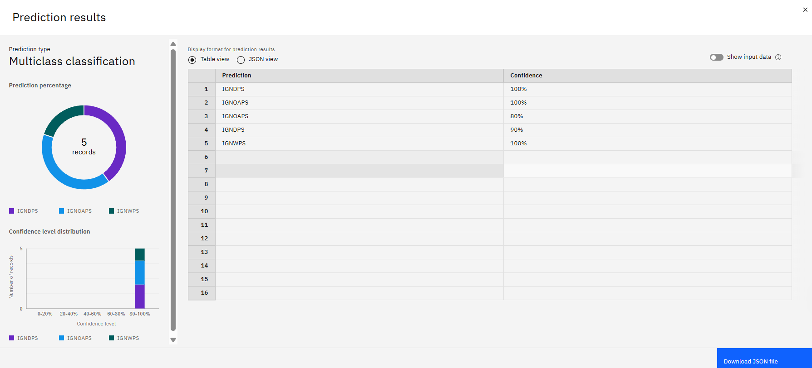

🧠 NSAP Scheme Classification Model using IBM AutoAI

📌 Project Overview

The National Social Assistance Program (NSAP) is a government welfare program in India that provides financial support to elderly individuals, widows, and persons with disabilities from below-poverty-line (BPL) households. This project uses IBM Watson Studio's AutoAI to automatically build a classification model that helps identify the most appropriate scheme for each applicant based on their demographic and socio-economic details.

⚙️ Key Features:

  • Predicts NSAP scheme codes based on applicant data

  • Automated data cleaning, feature engineering, and model optimization using AutoAI

  • Evaluation using classification metrics like accuracy and F1-score

  • One-click deployment on IBM Cloud

  • No manual coding required — built through AutoAI interface

🛠️ Technology Used:

  • IBM Watson Studio (AutoAI)

  • IBM Cloud for deployment
 
  • Dataset provided for NSAP applicants with features like:

  • Gender, Caste Category, State, District

  • Mobile Ownership, Aadhaar Status

  • Number of Dependents, Scheme Code

🚀 How It Works:

  • Data Collection – Historical applicant data including demographics and socio-economic details.

  • AutoAI Process – Handles preprocessing, selects best algorithm (e.g., Random Forest, XGBoost), and ranks pipelines.

  • Model Deployment – Best pipeline is deployed as a web service for real-time predictions.

  • Evaluation – Performance is assessed using accuracy, precision, recall, and F1-score.

📷 Screenshots

## 📷 Screenshots

### 🔧 AutoAI Pipeline Overview

### 📊 Dataset Preview

### 🌐 Deployed Web Service

📈 Results:

An intelligent model capable of suggesting the correct NSAP scheme for each applicant with high accuracy, reducing manual errors and ensuring faster delivery of benefits.

🔮 Future Scope:

   • Integrate with real-time applicant data portals

   • Expand eligibility prediction for other welfare programs

   • Improve model using advanced ML techniques or feedback loops
